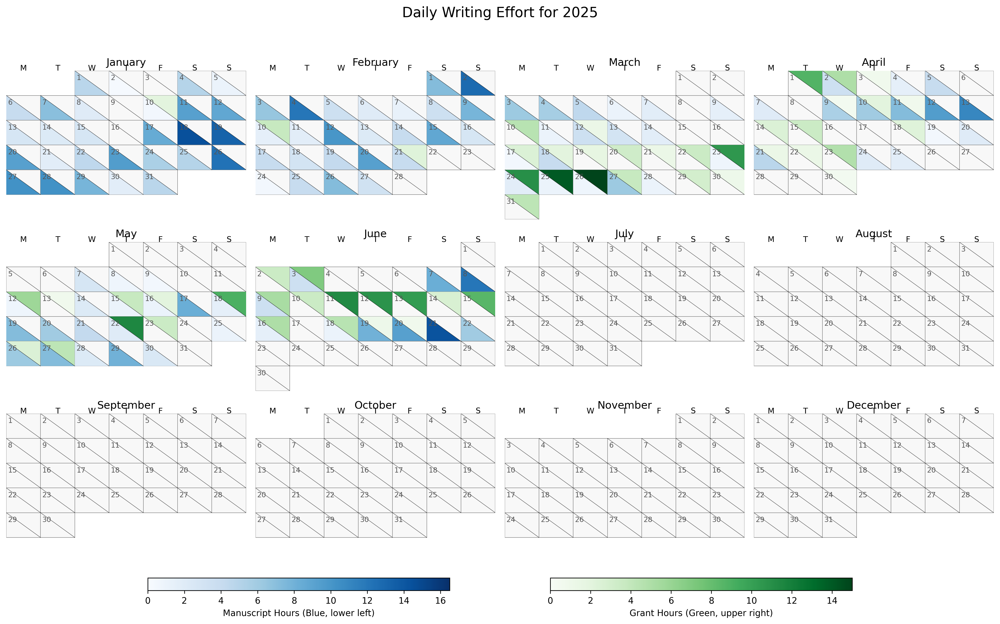

[](https://opensource.org/licenses/MIT)


# Heatmap with split boxes for reporting time spent on grant and article writing

## Problem addressed

I wanted an automated way to sum up the effort I had expended on various writing projects in the form of a heatmap.
The heat map of commits to GitHub is motivating in terms of encouraging frequent commits.
I can gain a similar motivational driving force by displaying in public a heat map of hours spent working on grant applications journal articles per day.
I started posting this on June 22, 2025; as you can see, I was still doing binge grant writing as of June 22.
Time will tell if this practice makes a difference.



### SQL code to generate the table zTimeSpent

```sql
CREATE TABLE "zTimeSpent" (
	"id"	INTEGER NOT NULL,
	"DateDashed"	DATE,
	"Start"	TIME,
	"End"	TIME,
	"TimeClock"	TIME GENERATED ALWAYS AS (strftime('%H:%M', CAST((julianday("End") - julianday("Start")) AS REAL), '12:00')) VIRTUAL,
	"TimeHr"	REAL GENERATED ALWAYS AS (ROUND((julianday("End") - julianday("Start")) * 24, 2)) VIRTUAL,
	"ProjectID"	INTEGER,
	"ProjectDirectory"	TEXT,
	"Description"	TEXT,
	"Activity"	TEXT DEFAULT 'none',
	PRIMARY KEY("id")
);
```
## Installation

1. Assign project numbers to projects in a separate database or spreadsheet. I also use these numbers to start the names of project folders on my home directory to ease navigation on the command line. Your home folder can hold over 10,000 files. There is no need to use `Documents`.
2. Edit the file paths in hmdgj.py to fit your workflow.
3. Install the required Python packages.  I am using a `pyenv` environment made with Python3.11 installed with `home brew`. The Python modules `calmap` and `calplot` will likely need to be installed using 'pip'. It may be best to use a `conda` or `pyenv` environment to avoid the Python dependency nightmare at the expense of wasting disk space with redundant files.
4. If you wish, set up a cron job to run hmdgj.py every morning and display the heatmap: `crontab -e; 0 3 * * * /Users/blaine/6003TimeTracking/cb/hmdgj.py`

This is an alias to make the plot, view it locally, and post it on GitHub.

```bash
hmdgj='cd ~/6003TimeTracking/cb && source python311-env/bin/activate && ./python311-env/bin/python3.11 hmdgj.py && deactivate && cp hmdgj.png ~/6112MooersLabGitHubLabRepos/writing-time-splitbox-heatmap/images/. && cd  ~/6112MooersLabGitHubLabRepos/writing-time-splitbox-heatmap && gac images/hmdgj.png "Updated." && git push && echo "Run hmddgj.py that shows a for calendar year 2025 by timespent on grants and journal articles."'
```

Here, `gac` is a bash function because I prefer entering one command over two:

```bash
gac () {
	echo "Function to git add a file and then commit the changes with a message."
	echo "Takes the name of a file and the message in a string."
	echo "Must set up a repository before using this function."
	if [ $# -lt 2 ]
	then
		echo "$0: not enough arguments" >&2
		echo "Usage: gca filename 'message about the commit'"
		return 2
	elif [ $# -gt 2 ]
	then
		echo "$0: too many arguments" >&2
		echo "Usage: gca filename 'message about the commit'"
		echo "Note absence of file extension .tex"
		return 2
	fi
	git add "$1"
	git commit -m "$2" "$1"
}
```

## Related site
mooerslab/writing-time-spent-heatmap
## Update history

|Version      | Changes                                                                                                                                                                         | Date                 |
|:-----------|:------------------------------------------------------------------------------------------------------------------------------------------|:--------------------|
| Version 0.1 |   Added badges, funding, and update table.  Initial commit.                                                                                                                | 6/22/2025  |

## Sources of funding

- NIH: R01 CA242845
- NIH: R01 AI088011
- NIH: P30 CA225520 (PI: R. Mannel)
- NIH: P20 GM103640 and P30 GM145423 (PI: A. West)
